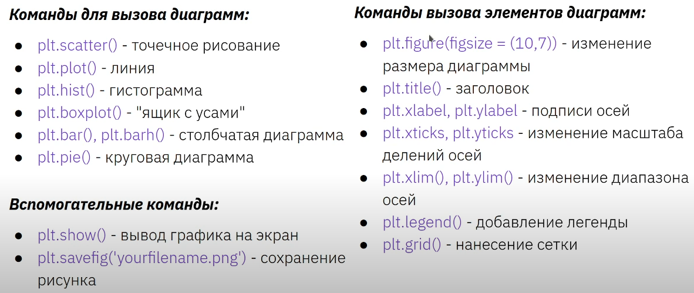

# Оглавление <a id="0"></a>

1. [Введение](#1)
    1. [Случайная величина](#1.1)
    2. [Генеральная совокупность и выборка](#1.2)
    3. [Описательная статистика](#1.3)
    4. [Меры центральной тенденции](#1.4)
    5. [Меры изменчивости](#1.5)
    6. [Квартили распределения и график box-plot](#1.6)
    7. [Нормальное распределение](#1.7)
    8. [Нормализация данных](#1.8)
    9. [Центральная предельная теорема](#1.9)
    10. [Закон больших чисел](#1.10)
    11. [Доверительные интервалы](#1.11)
    12. [Идея статистического вывода, p-value](#1.12)
2. [Сравнение средних](#2)
    1. [Параметрические и непараметрические методы](#2.1)
    2. [T-распределение](#2.2)
    3. [Сравнение двух средних; Парный t-test; t-критерий Стьюдента](#2.3)
    4. [Проверка распределения на нормальность](#2.4)
    5. [Однофакторый дисперсионный анализ](#2.5)
    6. [Множественные сравнения](#2.6)
    7. [Многофакторный ANOVA](#2.7)
3. [Корреляция и регрессия](#3)
    1. [Понятие корреляции](#3.1)
    2. [Регрессия с одной независимой переменной](#3.2)
    3. [Гипотеза о значимости взаимосвязи и коэффициент детерминации](#3.3)
    4. [Применение регрессионного анализа и интерпретация результатов](#3.4)
    5. [Регрессионный анализ с несколькими независимыми переменными](#3.5)
    6. [Трансформация переменных](#3.6)
    7. [Проблема гетероскедастичности и мультиколлинеарности](#3.7)
    8. [Нарушение допущения о независимости наблюдений](#3.8)
    9. [Эффекты в регресионных моделях](#3.9)
    10. [Обобщенные линейные модели (GLM)](#3.10)
4. [Анализ номинативных данных](#4)
    1. [Расстояние Пирсона](#4.1)
    2. [Распределение хи-квадрат](#4.2)
    3. [Анализ таблиц сопряженности](#4.3)
    4. [Точный критерий Фишера](#4.4)
5. [Логистическая регрессия и непараметрические методы](#5)
    1. [Логистическая регрессия](#5.1)
    2. [Когда нужно использовать непараметрические методы](#5.2)
    3. [U-критерий Манна — Уитни](#5.3)
    4. [Критерий Краскела-Уоллиса](#5.4)
    5. [Дорожная карта статистики](#5.5)
6. [Кластерный анализ и метод главных компонент](#6)
    1. [Кластерный анализ методом k - средних](#6.1)
    2. [Иерархическая кластеризация](#6.2)
    3. [Метод анализа главных компонент](#6.3)
7. [Деревья решений](#7)
    1. [Decision tree](#7.1)
    2. [Random Forest](#7.2)
8. [A/B тестирование](#8)
    1. [Создание эксперимента](#8.1)
    2. [Bootstrap](#8.2)
    3. [Мощность теста](#8.3)
9. [Оценка качества моделей](#9)
    1. [Оценки качества классификации](#9.1)
    2. [Оценки качества регрессии](#9.2)
    3. [Кросс-валидация](#9.3)
    4. [Состояния модели](#9.4)
    5. [Балансировка классов](#9.5)
10. [Визуализация](#10)
    1. [Карта визуализаций](#10.1)
    2. [Полезные функции в Matplotlib](#10.2)

___
# 1. Введение <a id="1"></a>
## 1.1 Случайная величина <a id="1.1"></a>
### Дискретные
Множество значений конечно или счётно (число звонков, очков на игральной кости).

**_Функция распределения_** - функция, которая определеяет вероятность события $X \leq x$, то есть

$$F(x)=P(X \leq x) = \sum{P(X=k) * \left [ X \leq x \right ]}$$

<p align="center">
  
</p>

### Непрерывные
Принимают бесконечное число значений (рост, время ожидания автобуса).

Функция распределения выглядит следующим образом:

$$F(x)=P(X \leq x) = \int_{-\infty}^{x}f(t)dt$$

Распределеине непрерывной СВ описывается **_плотностью распределения вероятностей_**. Плотность определена только для непрерывных СВ.

$$f(x)=F'(x)$$

___
## 1.2 Генеральная совокупность и выборка <a id="1.2"></a>
**_Генеральная совокупность (далее ГС)_** - совокупность всех объектов, относительно которых предполагается делать выводы при изучении некоторой задачи.

**_Репрезентативная выборка_** - это выборка, обладающая свойствами ГС.

Выборки могут быть:

* random
* stratified
* cluster

| Групповая выборка                                                                                                                | Стратифицированная выборка                                                                              |
|----------------------------------------------------------------------------------------------------------------------------------|---------------------------------------------------------------------------------------------------------|
| Выборка формируется только из нескольких субпопуляций (кластеров)                                                                 | Выборка формируется из всех субпопуляций (страт)                                                        |
| В пределах кластера элементы должны быть разнородны, тогда как поддерживается однородность или схожесть между разными кластерами | В пределах страты элементы должны быть однородны, а между стратами должна быть разнородность (различия) |
| Схема выборки нужна только для кластеров, попавших в выборку                                                                     | Должна быть сформирована полная схема выборки для всех стратифицированных субпопуляций                  |
| Повышает эффективность выборки, уменьшая стоимость                                                                               | Повышает точность                                                                                       |

___
## 1.3 Описательная статистика <a id="1.3"></a>
**_Эмпирические данные_** - данные, полученные опытным путем.

**_Описательная статистика_** - обработка данных, полученных эмпирическим путем и их систематизации, наглядное представление в виде графиков и таблиц.

**_Распределение вероятностей_** - это закон, описывающий область значений случайной величины и вероятность её появления (частоту) в данной области. То есть насколько часто $X$ появляется в данном диапазоне значений.

**_Гистограмма частот_** - ступенчатая функция показывающая насколько часто вероятно появление величины в указанном диапазоне значений.
___
## 1.4 Меры центральной тенденции <a id="1.4"></a>
* **_Мода_** - это значение признака, которое встречается максимально часто. В выборке может быть несколько или одна мода.
* **_Медиана_** - это значение признака, которое делит упорядочное множество попалам. Если множество содержит чётное количество элементов, то берётся среднее из двух серединных элементов упорядочного множества.
* **_Среднее_** - сумма всех значений измеренного признака делится на количество измеренных значений. Свойства:
$$M_{x+c}=M_{x}+c$$
$$M_{x*c}=M_{x}*c$$
$$\sum_{i=1}^{n}(x_{i}-M_{x})=0$$

<p align="center">
  
</p>

___
## 1.5 Меры изменчивости <a id="1.5"></a>
* **_Размах_** - это разность между максимальным и минимальным значениям выборки. Изменение крайних значений очень влияет на результат.
$$R = X_{max}-x_{min}$$
* **_Дисперсия_** - это средний квадрат отклонений индивидуальных значений признака от их средней величины (насколько в среднем значения отклоняются от среднего).
$$D = \frac{\sum_{i=1}^{n}(x_{i}-M_{x})^2}{n}$$
$$D = \frac{\sum_{i=1}^{n}(x_{i}-M_{x})^2}{n-1}$$
Первая формула - для ГС. n - 1 в выборке использутеся для корректировки (связано со степенями свободы).
  _Свойства_:
$$D_{x+c} = D_{x}$$
$$D_{x*c} = D_{x}*c^2$$
* **_Среднеквадратичное отклонение_** - это корень дисперсии. Лучше отражает изменчивость, так как показатель дисперсии завышен из-за квадрата в числителе.
  
  $σ$ - для ГС. $sd$ - для выборки (стандартное отклонение).
  
  _Свойства_:
$$sd_{x+c}=sd_{x}$$
$$sd_{x*c}=sd_{x}*c$$

`<p align="center">
  
</p>`

**_Коэффициент вариации_**, также известный как относительное стандартное отклонение, — это стандартная мера дисперсии распределения вероятностей или частотного распределения:

$$CV=\frac{σ}{M}$$

### Симметричность выборки
Если медиана и среднее близки друг к другу, то выборка называется симметричной.

$$|mean\ -\ median|\leq \frac{3sd}{\sqrt{n}}$$

___
## 1.6 Квартили распределения и график box-plot <a id="1.6"></a>
**_Квартили_** - $3$ точки, которые делят упорядоченное множество на $4$ равные части.

**_Box plot_** (ящик с усиками) - удобный вид диаграммы для статистических показателей.

<p align="center">
  
</p>

$Q$ и $IQR$ используют, чтобы оценить наличие выбросов. Алгоритм расчета - посчитать $Q$-ли, разницу между ними, вычислить теоретический максимум и минимум, сравнить с имеющимися и выяснить, есть ли выбросы и сколько их.

<p align="center">
  
</p>

___
## 1.7 Нормальное распределение <a id="1.7"></a>
* Унимодально
* Симметрично
* Отклонения наблюдений от среднего подчиняются определенному вероятностному закону; равновероятны.

<p align="center">
  
</p>

### Другие распределения

<p align="center">
  
</p>

___
## 1.8 Нормализация данных <a id="1.8"></a>
### Минимаксная нормализация

$$X'=\frac{x_i-x_{min}}{x_{max}-x_{min}}$$

Недостаткам минимаксной нормализации является наличие _аномальных_ значений данных, которые «растягивают» диапазон, что приводит к тому, что нормализованные значения _концентрируются_ в некотором узком диапазоне _вблизи нуля_.

### Z-преобразование

Преобразование полученных данных в стандартную z-шкалу **_со средним значением=0_** и **_дисперсией=1_**.

Чтобы привести к такому виду из каждого наблюдения нужно отнять среднее значение и разделить на стандартное отклонение:
$$Z_{i}=\frac{x_{i} - \bar{X}}{sd}$$
Иногда необходимо расчитать z-значение только для отдельно взятого наблюдения, чтобы выяснить, насколько далеко оно отклоняется от среднего значения в единицах стандартного отклонения.

Такое преобразование никак не влияет на форму распределения.

Чтобы посмотреть, насколько стандартных отклонений отклонилось выборочное среднее от среднего генеральной совокупности используется формула: 
$$Z=\frac{\bar{X}-M}{se}$$

**_Правило сигм в нормальном распределении_**:
* $M_x±σ\approx68$%
* $M_x±2σ\approx95$%
* $M_x±3σ\approx100$%

<p align="center">
  
</p>

[Distribution Calculator](https://gallery.shinyapps.io/dist_calc/)

[Таблица z-значений. Процент наблюдений, не превышающий указанное z-значение](https://web.archive.org/web/20180729102938/http://users.stat.ufl.edu/~athienit/Tables/Ztable.pdf)

**Задача №1**

|        Дано:        |               Решение:               |
|:-------------------:|:------------------------------------:|
|   $$\bar{X}=100$$   |           $sd=\sqrt{D}=5$            |
|       $$D=25$$      | $95$% $\approx\bar{X}+2sd={\color{Green}(90, 100)}$ |
|     **Найти:**      |                                      |
| Диапазон $95$% данных |    

**Задача №2**

|      Дано:      |                                          Решение:                                         |
|:---------------:|:-----------------------------------------------------------------------------------------:|
| $$\bar{X}=100$$ |                         $$z_{125}=\frac{x-\bar{X}}{sd}\approx1.7$$                        |
|    $$sd=15$$    | По таблице z-преобразования при $z=1.7$ - $95$% данных лежат слева от искомого значения. |
|    **Найти:**   |                            Значит $(IQ > 125)$% $= 100$%- $95$% = ${\color{Green}5}$%                            |
|   $(IQ > 125)$%  |                                                                                           |

**Задача №3**

|       Дано:      |                         Решение:                        |
|:----------------:|:-------------------------------------------------------:|
|  $$\bar{X}=100$$ |            $z_{70}=-2$ (Слева $2.28$% данных)           |
|     $$sd=15$$    |$z_{112}=0.8$ (Слева $78.81$% данных или справа $21.19$%)|
|    **Найти**:    |              $100- 2.28 -21.19\approx{\color{Green}77}$%               |
|$(70 < IQ < 112)$%|                                                         |

___
## 1.9 Центральная предельная теорема <a id="1.9"></a>
ЦПТ гласит, что множество средних выборок из генеральной совокупности (_ГС необязательно должно иметь нормальное распределение_) будут иметь _нормальное распределение_.

Причем средняя этого распределения будет _близко к средней ГС_, а sd этого распределения будет называться **стандартной ошибкой среднего (se)**.

$$se=\frac{σ}{\sqrt{N}}$$

Если $N$ достаточно большое $(> 30)$ и выборка является репрезентативной, то вместо σ можно взять $sd$.

* Стандартная ошибка среднего - среднеквадратическое отклонение распределения выборочных средних.
* Стандартная ошибка всегда меньше, чем стандартное отклонение при $n > 1$.
* $se$ тем меньше, чем больше $N$ и меньше вариативность исследуемого признака.
* Чем меньше $se$, тем реже выборочные средние будут сильно отклоняться от среднего в ГС.
___
## 1.10 Закон больших чисел <a id="1.10"></a>
ЗБЧ говорит, что при _больших_ выборках и _отсутствии аномалий_ среднее арифметическое, рассчитанное по выборке, оказывается близким к _теоретическому_ математическому ожиданию.

### Слабая форма ЗБЧ (Чебышёв)

$$\bar{X}=\frac{X_1+\ldots+X_n}{n} \rightarrow^p E(X_1)$$

Среднее сходится _по вероятности_ к математическому ожиданию при $n \rightarrow \infty$.

___
## 1.11 Доверительные интервалы <a id="1.11"></a>
Если мы имеем некоторую выборку и ГС, то мы не можем точно знать среднюю ГС, зная только среднее выборки. Однако мы можем сказать с некоторым процентом уверенности, в каком интервале лежит средняя ГС.

Средняя средних выборок стремится к средней ГС, а se среднего описывает $sd$ распределения средних выборок.

Если взять случайную выборку $X$ и найти $\bar{X}$, вычислить se, то можно найти доверительный интервал $(DI)$, который описывает среднюю ГС в некотором интервале с $n$% доверия.

* $DI(95)=\left [ \bar{X}\pm1.96*se \right ]$
* $DI(99)=\left [ \bar{X}\pm2.58*se \right ]$

Если рассчитать $95$% $DI$ для среднего значения, то:

* Мы можем быть на $95$% уверены, что $M$ в ГС принадлежит рассчитанному $DI$.
* Если многократно повторять эксперимент, для каждой выборки рассчитывать свой $DI$, то в $95$% случаев истинное среднее будет находиться внутри $DI$.
___
## 1.12 Идея статистического вывода, $p$-value <a id="1.12"></a>
Интерпретация $p$-уровня значимости:
* $p$-уровень значимости ничего не позволяет сказать о том, с какой вероятностью верна нулевая гипотеза $H_0$
* Если $p=0.05$, то это означает, что, если верна $H_0$, вероятность получить такие или еще более выраженные различия, равна $0.05$.
* $p$ не сообщает о силе эффекта, величине различий.
* Если $p>0.05$, то недостаточно оснований, чтобы отклонить $H_0$.
* Чтобы считать значения статистически достоверными, используется двусторонний p-уровень значимости, учитывая отклонения в обе стороны.
* Если отклонять $H_0$ рискованно, то нужно ставить маленький уровень значимости $\lambda$ - например, $0.01$.
* $DI$ - альтернатива $p$-value. Если значение $H_0$ не будет принадлежать $DI(95)$, то достаточно оснований отклонить $H_0$. 

**Статистические ошибки:**
Обычно нулевой гепотизой является то что мы хотим опровергнуть - это так называемый _Reject-Support_. Мы как исследователи хотим чтобы нуль-гипотеза был опровергнута  и при этом мы боимся совершить ошибку второго типа (потому что мы упустим возможность что-то исследовать) - поэтому мы будем набирать данные и пробовать таки опровергнуть ее.

А вот общество не хочет чтобы мы совершили ошибку Первого Типа - потому что последующие работы будут основаны на не верных выводах и в будущем все буду разочарованы.

<p align="center">
  
</p>

**Задача №4**

|        Дано:       |                             Решение:                            |
|:------------------:|:---------------------------------------------------------------:|
|       $M=20$       |                 1) $se=\frac{sd}{\sqrt{N}}=0.5$                 |
|       $N=64$       |                   $z=\frac{\bar{X}-M}{se}=-3$                   |
|   $\bar{X}=18.5$   |             По свойствам нормального распределения:             |
|       $sd=4$       |                   $P(X<-3, X>3)=0.0027<0.05$                  |
|   $H_0:M_{нп}=20$  |     2) $DI(95)=\left [ \bar{X}\pm*se \right ] = \left [ 17.52;19.48 \right ]$   |
| $H_1:M_{нп}\neq20$ | Следовательно, $20$ не принадлежит $DI(95)$ - отклоняем $H_0$  |
|     **Найти**:     |                $100 -2.28 -21.19 \approx{\color{Green}77}$%           |
|         $p$        |                                                                 |
|     $DI(95)$      |                                                                 |
___
# 2. Сравнение средних <a id="2"></a>
## 2.1 Параметрические и непараметрические методы <a id="2.1"></a>
**_Параметрические методы_**:
* Основанием таких методов являются вполне вероятные предположения о характере распределения случайной величины.
* Чаще всего эти методы используются в анализе экспериментальных данных и предположении _нормальности распределения_ этих данных.
* Метод параметрического анализа имеет достоинство, заключающееся в том, что обладает высокой мощностью, т.е. способностью избегать ошибки второго рода или $β$-ошибки.
* Параметрические тесты требуют специальных метрических шкал для описания имеющихся данных.
* Параметрическая статистика имеет постоянное число параметров и делает больше предположений.
* При правильности дополнительных предположений, параметрические методы дают более точные оценки. При неправильности предположений параметрические методы могут исследователя ввести в заблуждение.
* Параметрические формулы, однако, просты, их можно быстро записать и так же быстро вычислить.

**_Непараметрические методы_**:
* Непараметрическими называются такие методы, при которых не происходит выдвижение каких-либо предположений о характере распределения исследуемых данных.
* Непараметрические методы широко используются для изучения популяций, которые принимают ранжированный порядок (например, обзоры фильмов, которые могут получать от одной до четырех звезд). Использование непараметрических методов может быть необходимым, когда данные имеют ранжирование, но не имеют ясной численной интерпретации, например, при оценке предпочтений.
* Результатами работы непараметрических методов являются порядковые данные.

<p align="center">
  
</p>

___
## 2.2 T-распределение <a id="2.2"></a>
Если $N$ невелико и $σ$ неизвестно (почти всегда), используется **_распределение Стьюдента_** или $t$-distribution.

T-распределение - унимодально и симметрично, но наблюдения с большей вероятностью попадают за пределы $\pm2σ$ от $M$.

"Форма" распределения определяется **_числом степеней свободы_** $(df=n-1)$. С увеличением $df$ распределение стремится к _нормальному_. Если у нас есть $10$ наблюдений, и мы знаем среднее значение этих наблюдений, то достаточно знать среднее и только $9$ элементов, чтобы полностью знать, чему равен десятый элемент.

При расчете различных статистических показателей важно учитывать, как много элементов независимых было использовано, чтобы получить итоговое значение - это может приводить к абсоютно разным выводам.

Распределение отклонения выборочного среднего и среднего в генеральной совокупности, деленного на стандартную ошибку, будет описываться при помощи $t$-распределения: $t=\frac{\bar{X}-M}{\frac{sd}{\sqrt{n}}}$ в случаях, когда не известно $σ$ (далее при $n>30$).
___
## 2.3 Сравнение двух средних; Парный t-test; t-критерий Стьюдента <a id="2.3"></a>
Наиболее часто $t$-критерий применяется для проверки равенства средних значений в двух выборках. $H_0$ предполагает, что средние равны (отрицание этого - гипотеза сдвига).

Для применения данного критерия необходимо, чтобы исходные данные имели нормальное распределение.

$$t=\frac{\bar{X_1}-\bar{X_2}}{se}=\frac{\bar{X_1}-\bar{X_2}}{\sqrt{\frac{sd_{1}^2}{n_1}+\frac{sd_{2}^2}{n_2}}}$$

Применяя данный критерий, нужно, чтобы соблюдались требования:
* **_гомогенности_** (дисперсии внутри групп были приблезительно одинаковы - проверить можно с помощью _Критерия Фишера_ или _Тест Левена_)
* если число элементов $< 30$, то очень важно, чтобы данные внутри выборок были распеределены _нормально_. Если $> 30$, то t-test неплохо справляется с поставленной задачей, даже если распределение внутри выборок отличается от нормального.

**_Примеры применения t-критерий Стьюдента_**

1. Первая выборка — это пациенты, которых лечили препаратом А. Вторая выборка — пациенты, которых лечили препаратом Б. Значения в выборках — это некоторая характеристика эффективности лечения (уровень метаболита в крови, температура через три дня после начала лечения, срок выздоровления, число койко-дней, и т.д.) Требуется выяснить, имеется ли значимое различие эффективности препаратов А и Б, или различия являются чисто случайными и объясняются «естественной» дисперсией выбранной характеристики.

2. Первая выборка — это значения некоторой характеристики состояния пациентов, записанные до лечения. Вторая выборка — это значения той же характеристики состояния тех же пациентов, записанные после лечения. Объёмы обеих выборок обязаны совпадать; более того, порядок элементов (в данном случае пациентов) в выборках также обязан совпадать. Такие выборки называются связными. Требуется выяснить, имеется ли значимое отличие в состоянии пациентов до и после лечения, или различия чисто случайны.

3. Первая выборка — это поля, обработанные агротехническим методом А. Вторая выборка — поля, обработанные агротехническим методом Б. Значения в выборках — это урожайность. Требуется выяснить, является ли один из методов эффективнее другого, или различия урожайности обусловлены случайными факторами.

4. Первая выборка — это дни, когда в супермаркете проходила промо-акция типа А (красные ценники со скидкой). Вторая выборка — дни промо-акции типа Б (каждая пятая пачка бесплатно). Значения в выборках — это показатель эффективности промо-акции (объём продаж, либо выручка в рублях). Требуется выяснить, какой из типов промо-акции более эффективен.
___
## 2.4 Проверка распределения на нормальность <a id="2.4"></a>
Используется Q-Q Plot

<p align="center">
  
</p>

На графике: ось $X$ - предсказанные значения, если распределение идеально нормальное; ось $Y$ - реальные значения признака.

* Если точки выше прямой, то значениия слишком высокие, чем должны были получить.
* Если точки ниже прямой, то значениия слишком маленькие.

Для проверки на нормальность используется **_Shapiro-Wilk test_**. В таком тесте $p$-уровень значимости $< 0.05$ сообщает плохую новость, ведь придется отклонить $H_0$ о том, что данные распределены нормально.

_Выбросы значительно_ влияют на $t$-критерий. Менее чувствительной к выбросам **_Mann-Whitney U-Test_**, непараметрический аналог $t$-критерия.
___
## 2.5 Однофакторый дисперсионный анализ <a id="2.5"></a>

Переменная, разделяющая на группы - **_независимая_**.

Переменная, по которой идет сравнение - **_зависимая_**.

$t$-критерий и его непараметрические аналоги (например, Mann-Whitney U-test) предназначены для сравнения _исключительно 2 совокупностей_. В случаях $2+$ применяется $F$-test.

* Теоретическое распределение $F$-значения не является нормальным.
* $F$ всегда положительно, поэтому вероятность отклонения рассчитывается только в правую сторону.

$$SS_{total}=SS_{between}+SS_{within}$$

, где **_Межгрупповой_**:
* $SS_{between}=\sum_{j=1}^{p}n_j(x_{j}-\bar{X})^2$
* $df_{between}=m-1$
* $MS_{between}=\frac{SS_{between}}{df_{between}}$ (**_Межгрупповой средний квадрат_**)

**_Внутригрупповой_**:
* $SS_{within}=\sum_{j=1}^{p}\sum_{i=1}^{n_j}(x_{ij}-\bar{X_j})^2$
* $df_{within}=N-m$, где $m$ - _количество групп_
* $MS_{within}=\frac{SS_{within}}{df_{within}}$ (**_Внутригрупповой средний квадрат_**)

$$F=\frac{\frac{SS_{between}}{df_{between}}}{\frac{SS_{within}}{df_{within}}}=\frac{MS_{between}}{MS_{within}}$$

_Пример записи_: удалось выявить **статистически значимую взаимосвязь** $(F(3, 56)=8.04,p<0.05)$.

**Задача №5**

|                                              Дано:                                              |                                         Решение:                                         |
|:-----------------------------------------------------------------------------------------------:|:----------------------------------------------------------------------------------------:|
| $\begin{pmatrix} 1group & 2group & 3group\\  3 & 5 & 7\\  1 & 3 & 6\\  2 & 4 & 5 \end{pmatrix}$ |               $\bar{\bar{X}}=\frac{3+1+2+5+3+4+7+6+5}{9}=4$ - общая средняя              |
|                                        $H_0:M_1=M_2=M_3$                                        |                       $SS_{between}=3(2-4)^2+3(4-4)^2+3(6-4)^2=24$                       |
|                         $H_1:$ Как минимум 2 группы значимо различаются                         |                                     $df_{between}=2$                                     |
|                                                                                                 | $SS_{within}=(3-2)^2+(1-2)^2+(2-2)^2+(5-4)^2+(3-4)^2+(4-4)^2+(7-6)^2+(6-6)^2+(5-6)^2=6$  |
|                                                                                                 | при $\bar{X_1}=2; \bar{X_2}=4; \bar{X_3}=6$                                              |
|                                                                                                 | $df_{within}=6$                                                                          |
|                                                                                                 | $F=\frac{\frac{24}{2}}{\frac{6}{6}}=12$                                                  |
|                                                                                                 | $P(X>12)<0.05\Rightarrow H_0$ отклоняется                                                |

___
## 2.6 Множественные сравнения <a id="2.6"></a>
**_Внимание_**: Если многократно увеличивать количество групп, участвующих в исследовании, и сравнивать их между собой, то вероятность получить хотя бы одно значимое различие, которое на самом деле может и не быть, значительно увеличивается!

При множественном парном сравнении _необходимо корректировать уровень значимости_ для сравнения с $p$-уровнем.

Количество парных сравнений для выборок: $\frac{n(n-1)}{2}$, где n - число выборок.

**_Поправка Бонферрони_**: $\frac{\lambda}{\frac{n(n-1)}{2}}$

Бонферрони - довольно консервативное решение; при $100$ сравнениях, гарантируя отсутствие хотя бы одного ложного, упускается до $88$% реальных открытий.

**_Критерий Тьюики_**: $q=\frac{\bar{X_B}-\bar{X_A}}{se}=\frac{\bar{X_B}-\bar{X_A}}{\sqrt{\frac{MS_{within}}{n}}}$
___
## 2.7 Многофакторный ANOVA <a id="2.7"></a>
В многофакторном анализе $SS_{total}=SS_{between}+SS_{within_A}+SS_{within_B}+SS_{within_A}*SS_{within_B}$

**_Взаимодействие факторов_**: некоторая переменная оказывает различное влияние на интересующий показатель в зависимости от уровня или градации другой независимой переменной.

_Требования к данным_:
* Нормальность распределения в каждой из групп;
* Гомогенность дисперсий.

При $N > 50$ Anova _устойчива к нарушению_ обоих требований.
___
# 3. Корреляция и регрессия <a id="3"></a>
## 3.1 Понятие корреляции <a id="3.1"></a>
**_Ковариация_** - мера _линейной_ зависимости двух случайных величин.

$$ cov(X, Y) = \frac{\sum{(x_i - \bar{x})(y_i - \bar{x})}}{N - 1} $$

Однако только по _абсолютному_ значению ковариации _нельзя судить_ о том, _насколько сильно величины взаимосвязаны_, так как масштаб ковариации зависит от их дисперсий. Значение ковариации можно нормировать, поделив её на произведение среднеквадратических отклонений (квадратных корней из дисперсий) случайных величин. Полученная величина называется **_коэффициентом корреляции Пирсона_**, который всегда находится в интервале от $−1$ до $1$:

$$ r(x, y) = \frac{cov(x, y)}{\sigma_x\sigma_y}$$


* Коэффициент корреляции может принимать значения на промежутке $\left [ -1;1 \right ]$.
* Чем ближе значение коэффициента корреляции к 1 или к -1, тем сильнее взаимосвязь двух переменных.
* Положительное значение коэффициента корреляции говорит о том, что с увеличением значений одной переменной значения второй переменной так же увеличиваются.
* Высокая корреляция не обязательно означает статистически значимую взаимосвязь.
* Коэффициент неустойчив к выбросам.
* Исследуемые переменные должны быть распределены нормально и их взаимосвязь монотонна.
* Результаты только корреляционного исследования не позволяют нам делать вывод о причинно - следственной связи.
* Коэффициент корреляции может быть равен нулю.

Корреляция может использоваться для восстановления _пропущенных значений_ (вместе со средней).

**_Влияние третьей переменной_** - ошибка корреляции, при которой удалось получить статистически значимую взаимосвязь двух переменных, но в действительности переменная может содержать в себе другую информацию (третью переменную).

### Подробнее про формулу корреляции

Запишем формулу чуть подробнее и выполним возможные преобразования:

$$ r(x, y) = \frac{\sum{(x_i - \bar{x})(y_i - \bar{y})}}{(N - 1)\sqrt{\sum{\frac{(x_i - \bar{x})^2}{N-1}}}\sqrt{\sum{\frac{(y_i - \bar{y})^2}{N-1}}}} $$

теперь вынесем 1/ (N - 1) из под корней 

$$ r(x, y) = \frac{\sum{(x_i - \bar{x})(y_i - \bar{y})}}{(N - 1)\frac{1}{(N-1)}\sqrt{\sum{(x_i - \bar{x})^2}}\sqrt{\sum{(y_i - \bar{y})^2}}} $$

и сократим (N - 1)

$$ r(x, y) = \frac{\sum{(x_i - \bar{x})(y_i - \bar{y})}}{\sqrt{\sum{(x_i - \bar{x})^2}}\sqrt{\sum{(y_i - \bar{y})^2}}} $$

таким образом, мы сократили N - 1 в знаменателе и получили финальную формулу для коэффициента корреляции, которую часто можно встретить в учебниках:

$$ r(x, y) = \frac{\sum{(x_i - \bar{x})(y_i - \bar{y})}}{\sqrt{\sum{(x_i - \bar{x})^2}\sum{(y_i - \bar{y})^2}}} $$

### Корреляция Спирмена

Корреляция Пирсона улавливает только _линейную_ взаимосвязь и чувствительна к _выбросам_.

**_Корреляция Спирмена_** - мера силы монотонной взаимосвязи. Вычисляется как корреляция Пирсона между _рангами наблюдений_.

**_Ранг_** - порядковый номер наблюдения. Если встречаются несколько одинаковых значений, им присваивается одинаковое значение ранга, равное среднему арифметическому их порядковых номеров.

### Ложная корреляция

Корреляция между величинами может быть вызвана общими причинами, например общим трендом в данных.


___
## 3.2 Регрессия с одной независимой переменной <a id="3.2"></a>
**_Линейная регрессия_** — используемая в статистике регрессионная модель зависимости одной (объясняемой, зависимой) переменной $y$ от другой или нескольких других переменных (факторов, регрессоров, независимых переменных) $x$ с _линейной функцией зависимости_.

В общем виде функция линейной регрессии выглядит как:

$$\hat{y}=b_0+b_1x$$

* $b_1$ - **_slope_** задаёт наклон линии регрессии: $b_1 = \frac{sd_y}{sd_x}r_{xy}$
* $b_0$ - **_intercept_** значение пересечения линии с осью $Y$ : $b_0 = \bar{Y} - b_1\bar{X}$

Строят регрессионную прямую методом наименьших квадратов (МНК)

МНК - это способ нахождения оптимальных параметров линейной регресссии $b_0$  и $b_1$, таких, что сумма квадратов ошибок (остатков) была минимальная.

Если коэффициент корреляции между двумя переменными равен нулю, и обе переменные представлены в $z$-значениях, то уравнение регрессии примет вид $y = 0$.

### Условия применения линейной регрессии с одним предиктором
* Линейная взаимосвязь $X$ и $Y$.
* Нормальное распределение остатков.
* **_Гомоскедастичность_** - постоянная изменчивость остатков на всех уровнях независимой переменной.

[Diagnostics for simple linear regression](https://gallery.shinyapps.io/slr_diag/)

___
## 3.3 Гипотеза о значимости взаимосвязи и коэффициент детерминации <a id="3.3"></a>
$R^2$ - коэффициент детерминации, показывает в какой степени дисперсия одной переменной обусловлена влиянием другой переменной. Принимает значения $\left [ -1;1 \right ]$.

$$R^2=r_{xy}^2$$

**_Гипотеза о взаимосвязи двух переменных_** - чем больше коэффициент детерминации, тем большая часть дисперсии зависимой переменной обусловлена взаимосвязью с независимой переменной.

Если коэффициент детерминации равен нулю, то и коэффициент $b_1$ (slope) также равен нулю

$$t=\frac{b_1}{se}$$

при:
* $H_0$: $b_1=0$ (переменные никак не связаны, и линия аппроксимации абсолютно параллельна оси $X$ без наклона)
* $H_1$: $b_1\neq0$
* $df=N-2$

$R^2$ - доля дисперсии зависимой переменной $Y$, объясняемая регрессионной моделью.

$$R^2=1-\frac{SS_{res}}{SS_{total}}$$

где:
* $SS_{res}$ - сумма квадратов остатков (разности между наблюдаемыми значениями и значениями, предсказанными изучаемой регрессионной моделью).
* $SS_{total}$ - сумма квадратов разностей между наблюдаемыми значениями и среднего значения по переменной $Y$.

Если $\frac{SS_{res}}{SS_{total}}\rightarrow 1$, то $R\approx0$.

Если $\frac{SS_{res}}{SS_{total}}\rightarrow 0$, то $R\approx1$.

___
## 3.4 Применение регрессионного анализа и интерпретация результатов <a id="3.4"></a>
Задачи:

1. Построить регрессионную модель, которая максимально удачно объясняет взаимосвязь переменных, рассчитав $b_0$ и $b_1$.
2. Рассчитать коэффициент детерминации, ответив на вопрос "какой процент дисперсии объясняется моделью" - $H_0$: $b_1=0$.
3. Как, основываясь на данных независимой переменной, можно предсказать, чему будет равна зависимая переменная.

Коэффициент $b_i$ при независимой переменной демонстрирует насколько изменяется ожидаемое значение зависимой переменной при единичном изменении независимой переменной при условии, что все остальные независимые переменные _не изменяются._

**_Важное замечание_!** Не всегда линия тренда логически должна идти строго вверх или строго вниз.

___
## 3.5 Регрессионный анализ с несколькими независимыми переменными <a id="3.5"></a>
$$\hat{y}=b_0+b_1x+\ldots+b_nx_n$$

### Требования к данным:
* Линейная взаимосвязь ЗП и НП.
* Независимость наблюдений.
* Независимость предикторов (проблема мультиколлинеарности).
* Гомоскедастичность.
* Нормальное распределение остатков.
* Отсутствие **_автокорреляции_** остатков.

**_Adjusted_** $R^2$ - скорректированный $R^2$, который рассчитывается при включении в модель дополнительных переменных $(>1)$.

Удобная функция, позволяющий посмотреть на линейную взаимосвязь переменных и их распределение на одном графике.

```python
sns.jointplot(x='hs_grad', y='poverty', data=df, kind='reg')
```

___
## 3.6 Трансформация переменных <a id="3.6"></a>
_Линейная аппроксимация_ данных не сможет отловить изменения в случаях, если они связаны _нелинейно_, а, например, экспоненциально, а будет предсказывать дальше как _линейный тренд_, хотя в действительности точки могут быть уже над прямой и т.п.

**_Scatterplot_** может помочь визуально посмотреть на взаимосвязь переменных.

Скорее всего, если взаимосвязь нелинейна, то и ошибки будут распределены ненормально.

В случаях, когда связь нелинейна, можно _модифицировать_ переменную (зависимую, или независимую, или обе), чтобы в результате добиться более _линейной взаимосвязи_.

### Степенная трансформация

Основная идея - трансформировать НП, чтобы ликвидировать нелинейность связи (также может решить проблему гетероскедастичности).

<p align="center">
  
</p>

* При помощи трансформации Тьюки подбирается такой показатель степени, при котором **_абсолютное значение корреляции_** (по модулю) между переменными будет максимальным.
* Под $log$ подразумевается **_натуральный логарифм_** (здесь и далее).
* При использовании отрицательного показателя степени берется переменная с обратным знаком, чтобы избежать изменения направления исходной взаимосвязи.
* Если бы использовался ноль в качестве показателя степени, то все значения переменной стали бы равны друг другу.

Таким образом, можно увеличить **_предсказательную силу модели_**, сделав связь более линейной (также может решить проблему гетероскедастичности), однако такое преобразование тяжело интерпретировать.

### Логарифмическая трансформация

В отличие от степенной трансформации, позволяет интерпретировать исходные взаимосвязи между переменными.

* В модели $log(Y)=b_1 * X + b_0$ коэффициент наклона означает: при единичном изменении переменной $X$, переменная $Y$ в среднем изменяется на $100 * b_1$ процентов.
* В модели $Y=b_1 * log(X) + b_0$ коэффициент наклона означает: изменение на $1$% по $X$ в среднем приводит к $0.01 * b_1$ изменению по переменной $Y$.
* В модели $log(Y)=b_1 * log(X) + b_0$ коэффициент наклона означает: при единичном изменении $Y$ на $1$% значение по $X$ изменится на $b_1$ процентов.

### Трансформация Бокса — Кокса

Трансформация Бокса — Кокса (Box-Cox transformation) — широко используемый метод трансформации данных. В контексте регрессии он обычно используется для трансформации зависимой переменной в случае, если у нас есть ненормальное распределение ошибок и/или нелинейность взаимосвязи, а также в случае гетероскедастичности.

* $y_{new}=\frac{y^{p} - 1}{p}$, если $p\neq0$
* $y_{new}=log(y)$, если $p=0$

Параметр $p$ подбирается по следующей идее: используется то $p$, при котором качество модели максимально (обычно используется метод максимального правдоподобия). 

В случае множественной регрессии можно трансформировать зависимую переменную, чтобы добиться **_более высокого качества модели и выполнения требования к данным_**.

___
## 3.7 Проблема гетероскедастичности и мультиколлинеарности <a id="3.7"></a>
### Проблема гетероскедастичности
Если мы построим регрессию, где зависимой переменной будет квадрат остатков модели $y\approx x$, а независимой переменной будет предиктор $x$, и в этой модели окажется высокий и значимый $R$ квадрат, это означает, что в данных _есть гетероскедастичность_.

Один из основных тестов, проверяющих остатки на гетероскедастичность, - **_тест Уайта_**.

Чтобы избавиться от гетероскедастичности, можно попробовать _трансформировать данные_.

### Мультиколлинеарность
Мультиколлинеарность - наличие _линейной зависимости_ между объясняющими переменными (факторами) регресионной модели.

При полной коллинеарности данных, модель скорее всего не сойдется, и при коэффициентах нп будут nan.

При неполной мультиколлинеарность может внести сильный шум в интерпретацию результатов - увеличиваются se коэффициентов, $p$-значение для них может стать незначимым, и сами коэффициенты при нп могут быть нереалистичными.

Дабы найти наиболее коллинеарные предикторы, можно воспользоваться **_VIF_** (Variance Inflaction Factor, коэффициент вздутия дисперсии).

$$\widehat{var(\hat{b_{j}})}=\frac{s^{2}}{(n-1) \widehat{var(x_{j})}} * \frac{1}{1-R_{j}^{2}}$$

Исходя из формулы стандартной ошибки среднего для коэффициента наклона при переменной X1 в регрессии, значение стандартной ошибки тем больше, чем _больше дисперсия остатков_, _меньше дисперсия переменной X1_, _больше значение VIF_.

Обычно предиктор убирается, если его $VIF>=10$, однако, если у всех предикторов показатели в области, например, $1-2$, то можно убрать и предикторы с $VIF>=4$.

Кроме того, чтобы убрать мультиколлиарность можно воспользоваться [методом главных компонент](#6.3).

___
## 3.8 Нарушение допущения о независимости наблюдений <a id="3.8"></a>
### Зависимости, которые встречаются в исследованиях
* Повторные изменения
    * Снижение чувствительности теста;
    * Искусственное увеличение мощности теста (**_псевдорепликация_**)
* Несбалансированный дизайн
    * Искажение результатов
* Кластеризация данных
    * Искажение результатов

Один из способов избежать кластеризации наших наблюдений - формирование выборки способом, предполагающим, что любой элемент генеральной совокупности равновероятно может стать членом выборки.
___
## 3.9 Эффекты в регресионных моделях <a id="3.9"></a>
**_Фиксированный эффект_** - влияние НП, представляющее основной интерес для исследователя (обычно варьируется экспериментатором).

**_Случайный эффект_** - влияние НП, не представляющее первостепенного интереса для исследователя.

Применение **_смешанных моделей_** позволяет решить проблему псевдорепликации и зависимости наблюдений с помощью включения случайных эффектов в модель.

Если в модель включены случайные эффекты, то невозможно точно оценить число _степеней свободы_ для предикторов в модели.
___
## 3.10 Обобщенные линейные модели (GLM) <a id="3.10"></a>

<p align="center">
  
</p>

| Название регрессии                                  | Распределение                 | Значение ЗП         | Параметры                                                               | Типичная функция связи        |
|-----------------------------------------------------|-------------------------------|---------------------|-------------------------------------------------------------------------|-------------------------------|
| Линейная регрессия (Linear Gaussian Regression)     | Гауссовское / Нормальное      | $(-\infty; \infty)$ | $M$ - среднее $σ$ - стандартное отклонение                              | Identity (без преобразования) |
| Логистическая регрессия (Logistic Regression)       | Биномиальное (Бернулли с n=1) | $(0; 1)$            | $p$ - вероятность успеха $n$ - количество попыток                       | Логит                         |
| Мультиномиальная регрессия (Multinomial Regression) | Мультиномиальное              | $(0; 1)$            | $p_1 \ldots p_k$ - вероятность каждого события $n$ - количество попыток | Мультиномиальный логит        |
| Порядковая регрессия (Ordinal Regression)           | Кумулятивное пороговое        | $(0; 1)$            | $p_1 \ldots p_k$ - вероятность каждой категории                         | Порядковый логит              |
| Регрессия Пуассона (Poisson Regression)             | Пуассоновское                 | $(0; \infty)$       | $\lambda$ - темп                                                        | Логарифм                      |
| Регрессия Выживаемости                              | Вейбулловское                 | $(0; \infty)$       | $\alpha$ - дисперсия $Y$ - форма                                        | Логарифм                      |

* Переменная из _двух_ категорий - **_биномиальная_** регрессия.
* Категорий _больше_ - **_мультиномиальная_**.
* В категориях есть явное _убывание_ или _нарастание_ - **_порядковая_**.
* Считается какое-то _количество_ - **_пуассоновская_**.
* Есть какое-то _событие_ и _время_ до него - **_анализ выживаемости_** (Модель ускорения времени неудачи, **_AFT_**).

___
# 4. Анализ номинативных данных <a id="4"></a>
## 4.1 Расстояние Пирсона <a id="4.1"></a>
$\chi^2$ используется прежде всего для анализа таблиц сопряженности (вид таблицы, которая учитывает совместное влияние фактора на исход, данные в таблице сопряженности должны быть представлены в виде частоты номинальных данных или интервалами, но не непрерывными количественными величинами).

$$\chi^2=\sum_{i=1}^{n}\frac{(O_i-E_i)^2}{E_i}$$

где $O$ (observed) - наблюдаемая частота, $E$ (expected) - ожидаемая частота.

Для одной номинативной переменной $df=n-1$, где $n$ - количество столбцов таблицы.

### Условия применения критерия
* Желательно, чтобы общее количество наблюдений было более $20$.
* Ожидаемая частота, соответствующая нулевой гипотезе должна быть более $5$, если ожидаемое явление принимает значение менее $5$, то необходимо использовать точный Критерий Фишера.
* Для четырехпольных таблиц $(2х2)$: Если ожидаемое значение принимает значение менее $10$ - а именно $5$ < $x$ < $10$, необходим расчет поправки Йетса таблиц сопряженности.
* Сравниваемые частоты должны быть примерно одного размера.
* Сопоставляемые группы должны быть независимыми (то есть единицы наблюдения в них разные, в отличие от связанных групп, анализирующих изменения «до-после» у одних и тех единиц наблюдений до и после вмешательства. Для таких ситуаций существует отдельный тест МакНемара (McNemar).
* **_Запрещается_**: использовать хи-квадрат для анализа непрерывных абсолютных данных, процентов и долей.
___
## 4.2 Распределение $\chi^2$-квадрат <a id="4.2"></a>
Распределение $\chi^2$-квадрат с $k$ степенями свободы - это распределение суммы квадратов $k$ _независимых стандартных нормальных_ случайных величин.


Чем больше число степеней свободы у распределения хи-квадрат, тем более _симметричным_ становится такое распределение (стремится к нормальному).

<p align="center">
  
</p>


### Критические значения $\chi^2$ для $p < \lambda$

<p align="center">
  
</p>

___
## 4.3 Анализ таблиц сопряженности <a id="4.3"></a>
Для таблиц сопряженности $df=(n-1)*(m-1)$, где $n$ - количество столбцов таблицы, m - число строк таблицы.

Формулу для расчета ожидаемых частот в таблице сопряженности:

$$f_{ij}=\frac{f_i*f_j}{N}$$

* $f_i$ − число наблюдений в $i$−ой строке;
* $f_j$ − число наблюдений в $j$−ом столбце;
* $N$ − общее количество наблюдений в таблице.

### Поправка Йетса

В теориии распределение $\chi^2$ непрерывно, тогда как вычисляемые значения всегда дискретны, в результате $H_0$ может отвергаться слишком часто. Чтобы скорректировать значения $p$-уровня значимости, применяется поправка Йетса на непрерывность.

Обычно применяется, когда некоторые ожидаемые частоты $<10$.

$$\chi_{Yates}^2=\sum^k\frac{(|f_o-f_e|-0,5)^2}{f_e}$$

### Mosaicplot example
Позволяет визуализировать многомерные категориальные данные строгим и информативным способом:

<p align="center">
  
</p>

Выводы, которые можно сделать по графику:

```diff
+ Есть все основания отклонить нулевую гипотезу об отсутствии взаимосвязи пола и вероятности выжить в катастрофе.

+ Значимые отклонения между наблюдаемыми и ожидаемыми результатами получены во всех ячейках что позволяет говорить: мужчины вероятнее погибнут, чем выживут, а женщины — наоборот.

+ На борту Титаника большинство пассажиров - мужчины.

- Значимые отклонения между наблюдаемыми и ожидаемыми результатами получены во всех ячейках, что позволяет говорить: женщины вероятнее погибнут, чем выживут, а мужчины — наоборот.

- Значимые отклонения между наблюдаемыми и ожидаемыми результатами получены только в ячейках: Женщины: Выжили и Мужчины: Не выжили.

- Есть все основания принять нулевую гипотезу о взаимосвязи пола и вероятности выжить в катастрофе.

- Значимые отклонения между наблюдаемыми и ожидаемыми результатами получены только в ячейках: Женщины: Не выжили и Мужчины: Выжили.

- На борту Титаника большинство пассажиров - женщины.
```

___
## 4.4 Точный критерий Фишера <a id="4.4"></a>
Тест $\chi^2$ не является подходящим, когда математические ожидания значений в любой из ячеек таблицы с заданными границами оказывается _ниже_ $10$: вычисленное выборочное распределение испытуемой статистической величины только приблизительно равно теоретическому распределению хи-квадрат, и приближение неадекватно в этих условиях.

**_Тест Фишера_**, как следует из его названия, является точным, и может поэтому использоваться независимо от особенностей выборки. Тест становится трудно вычислимым для больших выборок или хорошо уравновешенных таблиц, но для этих условий хорошо применим критерий $\chi^2$.

|             | Юноши | Девушки | Всего |
|-------------|:-----:|:-------:|:-----:|
| На диете    | 1     | 9       | 10    |
| Не на диете | 11    | 3       | 14    |
| Всего       | 12    | 12      | 24    |

Фишер показал, что вероятность получения любого такого набора величин дается _гипергеометрическим распределением_:

$$P=\frac{(\frac{a+b}{a})(\frac{c+d}{c})}{(\frac{n}{a+c})}=\frac{(a+b)!(c+d)!(a+c)!(b+d)!}{n!a!b!c!d!}$$

Эта формула дает точную вероятность наблюдения любого специфического набора данных, при условии заданных маргинальных итогов, общего итога и нулевой гипотезе об одинаковой предрасположенности к диете независимо от пола (соотношение между людьми, которые на диете, и людьми, не находящимися на диете, для юношей такое же, как для девушек).

___
# 5. Логистическая регрессия и непараметрические методы <a id="5"></a>
## 5.1 Логистическая регрессия <a id="5.1"></a>
### From probability to odds to log of odds (Logit Function)
**_Odds_** - отношение вероятности успеха $(Y=1)$ к вероятности неудачи $(Y=0)$.

$$Logit\ Function=ln(\frac{p}{1-p})$$

После преобразования вероятности в логарифм шансов предсказания регрессионной модели могут быть на промежутке от минус до плюс бесконечности.

<p align="center">
  
</p>

### From log of odds to probability
$$p=\frac{e^{x}}{1+e^{x}}$$

где $x$ - значение log(odds).

### Intercept only model
Свободный член регрессии $intercept$ - это логарифм шанса положительного исхода.

$P < 0.05$ для свободного члена логистической регрессии означает, что:
* Вероятности двух исходов зависимой переменной значимо различаются между собой.
* Распределение исходов в нашей выборке значимо отличается от равномерного.

### Пример модели (Survied ~ Sex + Pclass)

По умолчанию уровни фактора располагаются в _алфавитном порядке_.

<p align="center">
  
</p>

$$y = 3.3081 - 3.7301 * sex_{male} - 0.8804 * Pclass_{second} - 3.4653 * Pclass_{third} - 0.4204 * sex_{male} * Pclass_{second} +2.1542 * sex_{male} * Pclass_{third}$$

___
## 5.2 Когда нужно использовать непараметрические методы <a id="5.2"></a>
На больших выборках, в силу высокой мощности, даже незначительное отклонение от нормального распределения будет приводить к значимым результатам Shapiro-Wilk test. Если корреляция на графике qqplot _превышает_ $0.95$ - это допустимое отклонение реальных данных от идеальных.

Если $N>30$, то это не освобождает от проверки на _нормальность_ распределения (даже в случае Т-теста).

Применять **_непараметрические тесты_**, если:
* Данные отличаются от нормального распределения.
* Выборки обладают негомогенностью дисперсий.
* Мало данных.

В некоторых задачах непараметрические тесты будут работать _даже лучше_, но это не панацея для всех исследований.

___
## 5.3 U-критерий Манна — Уитни <a id="5.3"></a>
Логика данного критерия заключается в том, что вместо сравнения средних значений в двух выборках критерий сравнивает **_сумму рангов_** (не медианы, как многие думают). Мы сначала упорядочиваем все данные, затем рассчитываем сумму рангов в каждой из групп.

Затем для каждой из выборок рассчитывается показатель:

$U_1=R_1-\frac{n_1*(n_1+1)}{2}$

$U_2=R_2-\frac{n_2*(n_2+1)}{2}$

Где $R_1$, $R_2$ - это сумма рангов в двух группах, а $n_1$, $n_2$ - число наблюдений.

Наименьшее из полученных значений и выступает в качестве статистики теста. Легко показать, что при условии верности нулевой гипотезы распределение этой статистики подчиняется нормальному распределению, где 

$M = \frac{n_{1} *  n_{2}}{2}$ и $σ = \sqrt{\frac{n_1 * n_2 * (n_1 + n_2 + 1)}{12}}$

что и позволяет рассчитать вероятность получить наблюдаемые или еще более выраженные различия суммы рангов.

Применять вместо t - теста: 

```diff
+ Распределения хотя бы в одной из выборок значительно отличается от нормального. 

+ Есть заметные выбросы в данных. 

+ В некоторых задачах мощность теста даже выше, чем t критерия (например, когда обеих выборках наблюдается заметная асимметрия в одинаковом направлении).

- Выборки разного размера, с различным направлением асимметрии.  
```
___
## 5.4 Критерий Краскела-Уоллиса <a id="5.4"></a>
Основная статистика критерия Краскела-Уоллиса - это _дисперсия средних значений рангов_ в сравниваемых группах. При верности $H_0$ распределение этой статистики можно описать при помощи распределения $\chi^2$.

$$H=\frac{12}{N(N+1)} * \sum_{i=1}^{k}\frac{R_{i}^2}{n_{i}}-3*(N+1)$$

$$N=\sum_{i=1}^{k}n_{i}$$

Разумно применять:

```diff
+ В сравниваемых группах распределение выборок значительно отличается от нормального, а также нарушается предположение о гомогенности дисперсий.
```

___
## 5.5 Дорожная карта статистики <a id="5.5"></a>

<p align="center">
  
</p>

___
# 6. Кластерный анализ и метод главных компонент <a id="6"></a>
## 6.1 Кластерный анализ методом $k$-means <a id="6.1"></a>
### Алгоритм

1. Выбрать число кластеров.
2. Выбрать исходные позиции центроидов.
3. Для каждого наблюдения определить, к какому центроиду оно ближе всего.
4. Обновить позиции центроидов (Определить геометрический центр координат).
5. Снова для каждого наблюдения определить, к какому центроиду оно ближе всего.
6. Если принодлежность точек изменилась - обновить их и перейти к шагу 4, иначе - конец.

### "Ошибки" кластерного анализа

<p align="center">
  
</p>

Решение "ошибок" кластерного анализа:
* Выбрать исходные позиции центроидов не случайно, а как наиболее удаленные точки друг от друга.
* Многократно повторять эксперимент, дабы найти оптимальные финальные центроиды.
* В данных нет выраженной структуры для проведение кластерного анализа.
* Имеет смысл попробовать изменить $k$.

### Выбор числа кластеров
**_Внутригрупповая сумма квадратов_** - сумма квадратов отклонений каждого наблюдения от центроида кластера.

**_Общая внутригрупповая сумма квадратов_** - сумма внутригрупповых сумм квадратов, рассчитанных для каждого кластера.

Если добавление еще одного кластера в данные _значительно понижает_ общую сумму квадратов, это означает, что в увеличении числа кластеров есть смысл.

Плавный график, который отражает взаимосвязь количества класстеров и общую внутригрупповую сумму квадратов, _без драматических падений_ может говорить о том, что _явная_ структура данных _отсутствует_.

Альтернатива **_методу локтя_** - **_коэффициент силуэт_**.

___
## 6.2 Иерархическая кластеризация <a id="6.2"></a>
### Алгоритм

1. Рассчитывается расстояние от каждой точки до каждой точки
2. Производится кластеризация методами иереархической кластеризации, например:
    * метод одиночной связи (ближайшего соседа) - Постепенно объеденяет две самые близкие точки в кластер, заменея их центроидом. В первую очередь объединяет самые близкие точки.
    * метод дальнего соседа - в последнюю очередь объединяет самые близкие точки.

<p align="center">
  
  
</p>

___
## 6.3 Метод анализа главных компонент <a id="6.3"></a>
**_Метод главных компонент (PCA)_** — метод машинного обучения без учителя, который находит основные компоненты (линейные комбинации переменных-предикторов), которые объясняют большую часть вариаций в наборе данных.

Используется для уменьшения размерности данных, избавление от мультиколлинеарности.

Когда мы выполняем PCA, нам интересно понять, какой процент от общей вариации в наборе данных можно объяснить каждым основным компонентом. Один из самых простых способов визуализировать процентную вариацию, объясняемую каждым основным компонентом, — это создать график **_Scree plot_**.

Оптимальное количество главных компонент может быть выбрано с помощью метода локтя (как в кластерном анализе). 

<p align="center">
  
</p>

**_Biplot_** одновременно отображает информацию о наблюдениях и главных компонентах. Данный график может оптимально представлять любые две из следующих характеристик: расстояния между наблюдениями, отношения между переменными (положительная или отрицательная взаимосвязь в зависимости от угла вектора, где тупой - отрицательная).

<p align="center">
  
</p>

___
# 7. Деревья решений <a id="7"></a>
## 7.1 Decision Tree Classifier<a id="7.1"></a>
**_Деревья решений_** позволяют решать задачи классификации и регрессии (Decision Tree Regressor). Они представляют собой иерархические древовидные структуры, состоящие из решающих правил вида «Если ..., то ...»

Процесс обучения — **_индукция_** дерева решений.

### Терминология

**_Узел_** - внутренний узел дерева, узел проверки.

**_Корневой узел_** - начальный узел дерева.

**_Лист_** - конечный узел дерева, терминальный.

**_Решаюшее правило_** - условие в узле, проверка.

**_Атрибут_** - независимая переменная, свойство.

### Процесс построения
Процесс построения деревьев решений заключается в _рекурсивном_ разбиении обучающего множества на подмножества с применением решающих правил в узлах и является **_жадным_** алгоритмом (_локально-оптимальные_ решения на каждом шаге приводят к _оптимальному итоговому_ решению). Процесс разбиения продолжается либо до тех пор, пока все узлы в конце всех ветвей не будут объявлены _листьями_, либо по достижении некоторого условия _остановки_.

### Выбор атрибута разбиения
#### Information gain. Энтропия
**_Энтропия_** - мера _неоднородности_ подмножества по представленным классам.

Лучшим атрибутом разбиения будет тот, который обеспечит _максимальное снижение энтропии_ результирующего подмножества относительно родительского.

$$H=-\sum_{i=1}^{n}\frac{N_i}{N} \log(\frac{N_i}{N})$$

где $n$ - число классов в исходном подмножестве, $N_i$ - число примеров $i$-го класса, $N$ - общее число примеров в подмножестве.

На практике, однако, говорят не об энтропии, а о величине, _обратной_ ей, которая называется **_информацией_**. Тогда лучшим атрибутом разбиения будет тот, который обеспечит _максимальный прирост_ информации результирующего узла относительно исходного:

$$Gain(A)=Info(S)-Info(S_A)$$

где $Info(S)$ - информация, связанная с подмножеством $S$ до разбиения, $Info(S_A)$ - информация, связанная с подмножеством, полученным при разбиении по атрибуту $A$.

#### Индекс Джини
Статистический смысл данного показателя в том, что он показывает — насколько часто случайно выбранный пример обучающего множества будет распознан неправильно, при условии, что целевые значения в этом множестве были взяты из определённого статистического распределения.

Очевидно, что данный показатель меняется от $0$ до $1$. При этом он равен $0$, если все примеры $Q$ относятся к одному классу, и равен $1$, когда классы представлены в равных пропорциях и равновероятны. Тогда лучшим будет то разбиение, для которого значение индекса Джини будут _минимальным_.

$$Gini(Q)=1-\sum_{i=1}^{n}p_{i}^{2}$$

где $Q$ - результирующее множество, $n$ - число кластеров в нем, $p_{i}$ - вероятность $i$-го класса (выраженная как относительная частота примеров соответствующего класса).

### Критерий остановки алгоритма
Работа алгоритма до получения абсолютных "чистых" подмножеств, содержащих примеры одного класса, может привести к **_переобучению_**.

* early stopping - алгоритм будет остановлен, как только будет достигнуто заданное значение некоторого критерия, например процентной доли правильно распознанных примеров. 
* max_depth - задание максимального числа разбиений в ветвях, по достижении которого обучение останавливается.
* min_samples_leaf - запретить алгоритму создавать листы с числом примеров меньше заданного, чтобы избежать создания тривиальных разбиений и, соответственно, малозначимых правил.
* max_leaf_nodes - задание максимального количества листьев, чтобы снизить вероятность делать индивидуальные листы для объектов.

Главным недостатком таких подходов является ущерб точности дерева, поэтому многие авторы рекомендуют отдавать предпочтение отсечению ветвей.

### Отсечение ветвей
1. Построить полное дерево (чтобы все листья содержали примеры одного класса).
2. Определить два показателя: **_относительную точность модели_** — отношение числа правильно распознанных примеров к общему числу примеров, и **_абсолютную ошибку_** — число неправильно классифицированных примеров.
3. Удалить из дерева листья и узлы, отсечение которых не приведёт к значимому уменьшению точности модели или увеличению ошибки.

### Дерево для регрессии
В качестве критерия "расщепления" на узлы используется среднеквадратическая ошибка (абсолютная и др.). Целевая функция - минимизация данного показателя.

$$MSE=\frac{1}{n}\sum_{i}^{n}(y_{true}-y_{pred})^2$$

где $y_{pred}$ - _усредненное_ значение целевой переменной. 

Исходя из этого, можно сформулировать атрибут разделения для задач регрессии - information gain.

$$IG=MSE_{root}-(\frac{n_{left}}{n}MSE_{left} + \frac{n_{right}}{n}MSE_{right})$$

___
## 7.2 Random Forest <a id="7.2"></a>
Основным недостатком деревьев решений является их склонность к _переобучению_ и тот факт, что даже при небольшом изменении обучающей выборки дерево может _значительно измениться_. Однако их объединение в _ансамбли_ или _композиции_ на практике дает очень хорошие результаты.

**_Ансамбли_** - это методы, сочетающие в себе _несколько_ алгоритмов машинного обучения для получения более _мощной_ модели. 

В случае задачи _регрессии_ при использовании композиции $a(x)$ из $N$ _базовых алгоритмов_ $b_{n}(x)$ ответом будет считаться _среднее значение_ ответа каждого алгоритма.

$$a(x) = \frac{1}{N}\sum_{n=1}^{N}b_{n}(x),$$

в задачах _классификации_, соответственно, знак полученного усредненного ответа или (что аналогично) класс определяется путем **_голосования_**: объект относится к классу, за который "проголосовало" наибольшее число _базовых_ алгоритмов.

<p align="center">
  
</p>

### Ошибка на новых данных

$$Ошибка\ на\ новых\ данных = Шум + Смещение + Разброс$$

* Шум - ошибка лучшей модели $a(x)$;
* Смещение - отклонение усредненных ответов наших моделей от ответов лучшей модели $a(x) (bias)$;
* Разброс - дисперсия ответов наших моделей (variance).

При _усреднении_ алгоритмов:
* Смещение _не меняется_
* $Разброс = \frac{Разброс\ базового\ алгоритма}{N} + корреляция\ между\ базовыми\ алгоритмами$

### Алгоритм

1. При построении случайного леса вначале генерируется количество _бутстрап-выборок_, равное _количеству деревьев_ в алгоритме.
2. Для уменьшения корреляции базовых алгоритмов рандомизируют сам процесс построения каждого дерева: если в стандартном методе построения деревьев в каждом узле выбирается $j$-й признак и порог $t$, с которым сравнивается его значение, и потом эти значения оптимизируются с помощью _функции ошибки_, то в методе случайного леса в каждой вершине $j$-й признак выбирается не из всего пространства признаков, а из его случайного подмножества размера $m$*, _которое каждый раз выбирается заново_.
3. Далее построенные деревья объединяются в композицию, и при предсказаниях с его помощью используется усредненный ответ на каждом дереве.

*В задачах классификации рекомендуется брать $m = \sqrt{d}$, где $d$ - общее число признаков, и строить дерево до тех пор, пока в каждом листе не останется по одному объекту, а в задаче регрессии принимать $m = d/3$ и строить дерево, пока в листьях не останется по пять объектов.

### Особенности алгоритма

* Один из сильнейших “классических" алгоритмов машинного обучения.
* Не требователен к обучающей выборке (не требуется нормализация, очистка от шума, ...).
* Легко параллелится, так как базовые модели обучаются независимо друг от друга.
* Слабо подвержен переобучению. 
* Дает оценку важности признаков (feature importance).
* Не требует дополнительной валидационной выборки (за счет OOB-score).

___
# 8. A/B тестирование <a id="8"></a>
## 8.1 Создание эксперимента <a id="8.1"></a>
[Создания A/B тестов на языке Python.]('https://vkteam.medium.com/practitioners-guide-to-statistical-tests-ed2d580ef04f')

[Как правильно выстроить работу b2c: на какие метрики необходимо смотреть и как их учитывать для улучшения работы.]('https://onlineuserengagement.github.io/')

Пользователи должны делиться на **_контрольную_** $(A)$ и **_тестовую_** $(B)$ группы в рамках _одинаковых условий_.

**_Проектирование эксперимента_** $A/B$-тестирования (условия формулируются до его запуска):
1. Сформулировать бизнес-проблему и гипотезу.
2. Определить ключевые и дополнительные метрики.
3. Сформулировать ожидаемый эффект на метрики.
4. Спрогнозировать сроки эксперимента.
5. Установить условия окончания теста, критерий успеха и принципы принятия решения.

**_Конверсия_** - отношение количества пользователей, совершивших целевые действия (клик, покупка и т.п.), к общему количеству пользователей.

Для успешного эксперимента:
* При расчете конверсии необходимо рассчитать **_окно конверсии_** - это можно сделать с помощью исторических данных, взяв оптимальный перцентиль для срока совершения целевого действия.
* Правильно выполнить **_сплитование_** - деление пользователей на группы. Должны сохраняться пропорции в геохарактеристиках, маркетинговых группах или других сегментах.
* Рассчитать статистический критерий и p-уровень значимости.

Расчет статистики:
* Для номинативных переменных (конверсия) - $\chi^2$ (параметрический), Точный критерий Фишера (непараметрический) при $2$ группах и ANOVA (параметрический), Краскела-Уоллиса (непараметрический).
* Для количественных переменных (сумма покупок, проведенное время) - $t$-критерий Стьюдента (параметрический), $U$-критерий Манна-Уитни (непараметрический).

___
## 8.2 Bootstrap <a id="8.2"></a>
Когда можно использовать:
* результаты статистических критериев отличаются на порядок.
* непараметрический критерий тяжело интерпретировать, а для параметрического аналога маленькая выборка или ненормальное (*) распределение (t-тест может выдавать некорректные результаты)
* чтобы оценить различные показатели в данных (медиану, перцентили).

Идея бутстрепа в том, чтобы использовать результаты вычислений по выборкам как "фиктивную популяцию" подобно _ЦПТ_ с целью определить выборочное распределение статистики. Фактически, при этом анализируется большое число случайных выборок с _возвращением_ (один и тот же элемент может попадаться несколько раз), называемых бутстреп-выборками.

_Этапы_:

1. Итак, пусть имеется выборка $(X_1, X_2, \ldots , X_n)$, случайным образом выбирается один из элементов выборки, затем возвращается в выборку, вновь случайным образом выбирается элемент и тд.
2. Описанную процедуру случайного выбора $n$ раз.
3. Таких выборок генерируется несколько тысяч.
4. Для каждой выборки строится оценка интересующей величины, далее оценки усредняются.

Если выборки генерируются _без возвращения_ элементов, то получается метод **_складного ножа_**.

В бутстрепе также используется идея гипотез, где $H_0$ говорит о том, что значимых различий нет и показатели равны (значит в доверительном интервале должен оказаться $0$).

```python
def get_bootstrap(
    data_column_1, # числовые значения первой выборки
    data_column_2, # числовые значения второй выборки
    boot_it = 1000, # количество бутстрэп-подвыборок
    statistic = np.mean, # интересующая нас статистика
    bootstrap_conf_level = 0.95 # уровень значимости
):
    boot_len = max([len(data_column_1), len(data_column_2)])
    boot_data = []
    for i in tqdm(range(boot_it)): # извлекаем подвыборки
        samples_1 = data_column_1.sample(
            boot_len, 
            replace = True # параметр возвращения
        ).values
        
        samples_2 = data_column_2.sample(
            boot_len, # чтобы сохранить дисперсию, берем такой же размер выборки
            replace = True
        ).values
        
        boot_data.append(statistic(samples_1-samples_2)) 
    pd_boot_data = pd.DataFrame(boot_data)
        
    left_quant = (1 - bootstrap_conf_level)/2
    right_quant = 1 - (1 - bootstrap_conf_level) / 2
    quants = pd_boot_data.quantile([left_quant, right_quant])
        
    p_1 = norm.cdf(
        x = 0, 
        loc = np.mean(boot_data), 
        scale = np.std(boot_data)
    )
    p_2 = norm.cdf(
        x = 0, 
        loc = -np.mean(boot_data), 
        scale = np.std(boot_data)
    )
    p_value = min(p_1, p_2) * 2
        
    # Визуализация
    _, _, bars = plt.hist(pd_boot_data[0], bins = 50)
    for bar in bars:
        if abs(bar.get_x()) <= quants.iloc[0][0] or abs(bar.get_x()) >= quants.iloc[1][0]:
            bar.set_facecolor('red')
        else: 
            bar.set_facecolor('grey')
            bar.set_edgecolor('black')
    
    plt.style.use('ggplot')
    plt.vlines(quants,ymin=0,ymax=50,linestyle='--')
    plt.xlabel('boot_data')
    plt.ylabel('frequency')
    plt.title("Histogram of boot_data")
    plt.show()
       
    return {"boot_data": boot_data, 
            "quants": quants, 
            "p_value": p_value}
```

___
## 8.3 Мощность теста <a id="8.3"></a>
Мощность теста - вероятность увидеть различия там, где они действительно есть.

Обычно берется мощность >= $80$%.

___
# 9. Оценка качества моделей <a id="9"></a>
## 9.1 Оценки качества классификации <a id="9.1"></a>
### Общие понятия
* $TP$ — **_True Positive_**: классификатор верно отнёс объект к рассматриваемому классу.
* $TN$ — **_True Negative_**: классификатор верно утверждает, что объект не принадлежит к рассматриваемому классу.
* $FP$ — **_False Positive_**: классификатор неверно отнёс объект к рассматриваемому классу.
* $FN$ — **_False Negative_**: классификатор неверно утверждает, что объект не принадлежит к рассматриваемому классу.

### Confusion matrix (Матрица ошибок)

<p align="center">
  
</p>

Для многоклассовой классификации матрица несоответствий строится по тому же принципу:

<p align="center">
  
</p>

### Простые оценки

**_Accuracy_** — (точность) показывает долю правильных классификаций. Несмотря на очевидность и простоту, является одной из самых малоинформативных оценок классификаторов.

Плохо работает при дисбалансе классов (Fraud Detection), разной цене ошибок (Кредитный скоринг).

$$Accuracy=\frac{TP+TN}{TP+TN+FP+FN}$$

**_Recall_** — (полнота, sensitivity, TPR (true positive rate)) показывает отношение верно классифицированных объектов класса к общему числу элементов этого класса.

$$Recall=\frac{TP}{TP+FN}$$

**_Precision_** - (точность, перевод совпадает с accuracy) показывает долю верно классифицированных объектов среди всех объектов, которые к этому классу отнес классификатор.

$$Precision = \frac{TP}{TP+FP}$$

<p align="center">
  
</p>


**_Specificity_** — показывает отношение верных срабатываний классификатора к общему числу объектов за пределами класса. Иначе говоря, то, насколько часто классификатор правильно не относит объекты к классу.

$$Specificity = \frac{TN}{FP+TN}$$

**_Fall-out_** — (FPR (false positive rate)) показывает долю неверных срабатываний классификатора к общему числу объектов за пределами класса. Иначе говоря то, насколько часто классификатор ошибается при отнесении того или иного объекта к классу.

$$FPR = \frac{FP}{FP+TN}$$

Ввиду того, что такие оценки никак _не учитывают изначальное распределение_ классов в выборке (что может существенно влиять на полученное значение), также существуют _взвешенные_ варианты этих оценок (в терминах многоклассовой классификации):

$$Precision_{W}=\frac{\sum_{i=1}^{k}\frac{T_{i}P_{i}}{C_i}}{All}$$

$$Recall_{W}=\frac{\sum_{i=1}^{k}T_i}{All}$$

### $F$-мера
Гармоническое среднее двух показателей:

$$F=\frac{2*precision*recall}{precision+recall}$$

Оригинально вычисляется для позитивного класса случая бинарной классификации, обобщается с помощью приниципа «один против всех»: _каждый_ класс ровно _один_ раз становится «положительным», а остальные — отрицательным.

Существует _взевешенный_ показатель, где recall учитывается в $β$ раз более важным чем precision при $β > 1$ и менее важным при $β < 1$. При $β = 1$ обычная формула.

### AVG metrics

Усреднения могут помочь, когда задача мультиклассовая.

* micro avg - равна accuracy. Показательна при идеальном балансе классов.
* macro avg - среднее арифметическое метрик, рассчитанных для каждого класса. Показательна при дисбалансе классов и когда важен _каждый_ класс.
* weighted avg - сумма произведений метрик на долю наблюдений одного класса из всех наблюдений (взвешенное среднее). Показательна при дисбалансе классов и когда важен _наибольший_ класс.

### ROC-кривая
Для наглядной оценки качества алгоритма применяется ROC-кривая. Кривая строится на плоскости, определённой TPR (по оси ординат) и FPR (по оси абсцисс):

<p align="center">
  
</p>

Алгоритм построения кривой:
1. Запустить классификатор на тестовой выборке.
2. Отсортировать результаты по уверенности классификатора в принадлежности объекта к классу (классификатор должен вернуть вероятности).
3. Пока не кончились элементы:
    1. Взять объект с максимальной уверенностью
    2. Сравнить метку с реальной
    3. Пересчитать TPR и FPR на взятых объектах
    4. Поставить точку, если обе характеристики не NaN / ±∞
4. Построить кривую по точкам

Для численной оценки алгоритма по ROC-кривой используется значение площади под ней (AUC, area under curve). Идеальный алгоритм имеет AUC, равный $1$, худший — $0.5$. Это связано с тем что при хорошей классификации надо получать _максимальный_ TPR при _минимальном_ FPR.

$$AUC=\int_0^{1}TPRdFPR$$

___
## 9.2 Оценки качества регрессии <a id="9.2"></a>
### Средние ошибок
**_Средняя квадратичная ошибка_** - применяется в ситуациях, когда нам надо подчеркнуть _большие_ ошибки и выбрать модель, которая дает меньше больших ошибок прогноза. Грубые ошибки становятся заметнее за счет того, что ошибку прогноза мы возводим в _квадрат_. И модель, которая дает нам меньшее значение среднеквадратической ошибки, можно сказать, что что у этой модели меньше _грубых_ ошибок.

$$MSE=\frac{1}{n}\sum_{i=1}^{n}(a(x_i)-y_i)^2$$

**_Средняя абсолютная ошибка_** - менее чувствительна к выбросам, проще в интерпретации (например, модель в среднем ошибается на $4).

$$MAE=\frac{1}{n}\sum_{i=1}^{n}|a(x_i)-y_i|$$

**_Средняя абсолютная процентная ошибка_** - коэффициент, не имеющий размерности, с очень простой интерпретацией. Его можно измерять в долях или процентах. Если получилось, например, что $MAPE=11.4$%, то это говорит о том, что ошибка составила $11.4$% от фактических значений. Основная проблема данной ошибки — _нестабильность_.

$$MAPE=p_{100} * \frac{1}{n}\sum_{i=1}^{n}\frac{|y_i - a(x_i)|}{|y_i|}$$

где p_100 = 100%

**_Коэффициент детерминации_** - измеряет _долю дисперсии_, объясненную моделью, в общей дисперсии целевой переменной. Фактически, данная мера качества — это _нормированная_ среднеквадратичная ошибка. Если она близка к единице, то модель хорошо объясняет данные, если же она близка к нулю, то прогнозы сопоставимы по качеству с константным предсказанием.

$$R^2=1-\frac{\sum_{i=1}^{n}(a(x_{i})-y_{i})^{2}}{\sum_{i=1}^{n}(y_i-\bar{y})^{2}}$$

___
## 9.3 Кросс-валидация <a id="9.3"></a>
**_Кросс-валидация_** — процедура эмпирического оценивания обобщающей способности алгоритмов. С помощью кросс-валидации эмулируется наличие тестовой выборки, которая не участвует в обучении, но для которой известны правильные ответы.

### k-fold
1. Обучающая выборка разбивается на $k$ непересекающихся одинаковых по объему частей.
2. Производится $k$ итераций. На каждой итерации происходит следующее:
    1. Модель обучается на $k−1$ части обучающей выборки;
    2. Модель тестируется на части обучающей выборки, которая не участвовала в обучении.

Каждая из $k$ частей единожды используется для тестирования. Как правило, $k=10$ (5 в случае малого размера выборки).

<p align="center">
  
</p>

### Случайные разбиения (Random subsampling)
Выборка разбивается в случайной пропорции. Процедура повторяется несколько раз.

### Другие
* Валидация на отложенных данных (Hold-Out Validation)
* Полная кросс-валидация (Complete cross-validation)
* t×k-fold кросс-валидация
* Кросс-валидация по отдельным объектам (Leave-One-Out)
* Критерий целостности модели (Model consistency criterion)


___
## 9.4 Состояния модели <a id="9.4"></a>

<p align="center">
  
</p>

___
## 9.5 Балансировка классов <a id="9.5"></a>

<p align="center">
  
</p>

* Undersampling может привести к недообучению.
* Oversampling может привести к переобучению.

```python
from imblearn.over_sampling import SMOTE, ADASYN
from imblearn.under_sampling import TomekLinks
```
___
# 10 Визуализация <a id="10"></a>
## 10.1 Карта визуализаций <a id="10.1"></a>

<p align="center">
  
</p>

___
## 10.2 Полезные функции в Matplotlib <a id="10.2"></a>

<p align="center">
  
</p>

___

[В начало](#0)
